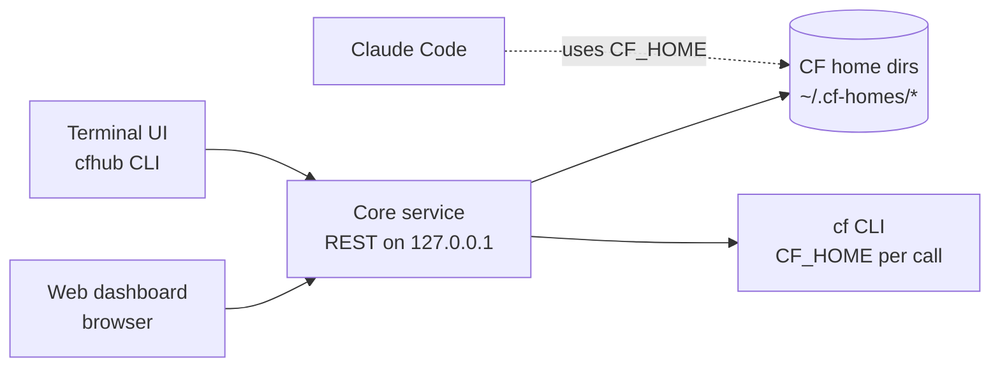

# CF Session Hub

One local tool that manages Cloud Foundry sessions for several organizations — each in its own
`CF_HOME` directory — and hands a ready, authenticated `CF_HOME` to Claude Code, so Claude Code
never runs `cf login`.

The hub takes over authentication end to end: it opens the browser itself, completes the SSO
passcode flow, keeps sessions alive with the cf CLI's own refresh token, and shows at a glance
which organizations are logged in.

## Why

Every organization has its own CF home directory with separate credentials. Point Claude Code at
one and it tries `cf login --sso`, cannot open a browser for the passkey, falls back to printing a
passcode URL and a manual command — every session, again. With the hub, Claude Code only ever
points `CF_HOME` at a directory that is already authenticated.

## Architecture

Three packages in one repo. All logic lives in the local core service; the web dashboard and the
terminal UI are thin clients on the same REST API, so both offer identical behavior. All state
stays inside the CF home directories themselves (the cf CLI's own `config.json`) — the hub stores
no credentials of its own.

```
packages/core/   service, REST API, scanner, login orchestration, keep-alive scheduler
packages/web/    dashboard, static assets served by core
packages/cli/    cfhub
```



## Requirements

- Node.js 20 or newer
- cf CLI v8 or newer on `PATH` (the hub shells out to it and never reimplements its auth)
- macOS or Linux (`open` / `xdg-open` for the browser step)

## Install

```bash
npm install          # also builds every package (via the prepare script)
```

Then put the two wrappers on your `PATH`:

```bash
ln -s "$PWD/bin/cfhub" /usr/local/bin/cfhub
ln -s "$PWD/bin/cf-session-hub" /usr/local/bin/cf-session-hub
# or simply: export PATH="$PWD/bin:$PATH"
```

`npm link --workspaces` works too, but the wrappers are the simplest route and keep working after
a rebuild.

## Use

Start the service and open the dashboard:

```bash
cf-session-hub          # http://127.0.0.1:4790
```

`cfhub` starts the service by itself when it is not running, so in a terminal next to Claude Code
you can go straight to:

```bash
cfhub list                    # every entry with status, org/space and expiry
cfhub login acme-prod         # opens the browser, then prompts for the passcode
eval $(cfhub env acme-prod)   # sets CF_HOME in the current shell
cfhub orgs acme-prod          # organizations this session can see
cfhub target acme-prod        # pick org, then space, from numbered lists
cfhub target acme-prod -o acme -s prod
cfhub verify                  # live check for every entry (also refreshes tokens)
cfhub logout acme-prod
cfhub snippet acme-prod       # the CLAUDE.md block for a project
```

## CF home directory model

A configurable root folder (default `~/.cf-homes`) holds one subdirectory per organization. The
subdirectory name is the entry's id and default label, and each holds the cf CLI's own
`.cf/config.json`.

Fields read from `.cf/config.json`:

| Field | Used for |
| --- | --- |
| `Target` | API endpoint shown per entry |
| `OrganizationFields.Name` | Current org |
| `SpaceFields.Name` | Current space |
| `AccessToken` | JWT; the payload's `exp` gives the expiry |
| `RefreshToken` | Presence means the CLI can auto-refresh |
| `AuthorizationEndpoint` / `UaaEndpoint` | Base for the SSO passcode URL |

Optional hub metadata per entry lives in `<dir>/hub.json`:

```json
{ "label": "Acme prod", "api": "https://api.cf.example.com", "defaultOrg": "acme", "defaultSpace": "prod", "keepAlive": true }
```

Entries can be created from the dashboard (new directory + `hub.json`) or simply discovered from
directories that already exist.

### Adopting CF home directories from elsewhere

CF home directories that already live outside the root do not have to move. List them under
`paths` in the hub config and they appear beside the root's own subdirectories:

```json
{
  "paths": [
    { "id": "elia", "dir": "~/.cf-elia" },
    { "id": "ec",   "dir": "~/.ec" }
  ]
}
```

`id` is the entry id and its default label; `dir` is the CF home directory itself — the folder that
*contains* `.cf/config.json`, not the `.cf` folder. For the cf CLI's default session that is your
home directory (`~`), because its config is `~/.cf/config.json`.

The hub reads and writes an adopted directory exactly like a root subdirectory, but never creates
or moves one: a `dir` that does not exist is skipped rather than reported as an error. When an
adopted `id` matches a root subdirectory, the adopted directory wins.

### Status

| Status | Rule |
| --- | --- |
| `active` | Access token `exp` more than 5 minutes away |
| `refreshable` | Token expired or expiring but a refresh token is present; a live check confirms and refreshes |
| `expired` | No valid token and no refresh token (or refresh fails) |
| `unknown` | `config.json` missing or unreadable |

The live check is `CF_HOME=<dir> cf curl /v3/organizations?per_page=1`. Running it makes the cf CLI
refresh the access token itself.

## Switching org and space

Each entry's card carries an **Org** and a **Space** dropdown, and `cfhub target` does the same
from the terminal. Both call `cf target` for that `CF_HOME` and then store the choice as the
entry's `defaultOrg`/`defaultSpace`, so the next login lands in the same place instead of
reverting.

Choosing an org targets it immediately and leaves no space selected, exactly as `cf target -o`
does; the space dropdown then lists that org's spaces. The lists come from `/v3/organizations`
and `/v3/spaces` on first use rather than on every dashboard load, since each costs a live cf
call. A switch made in one client reaches the others over `/api/events`.

`cfhub target <entry>` prompts with numbered lists. Passing `-o` without `-s` is a plain org
switch and never prompts, so it is safe in a script.

## Configuration

`~/.config/cf-session-hub/config.json` — created on demand, every field optional:

```json
{
  "root": "~/.cf-homes",
  "paths": [{ "id": "elia", "dir": "~/.cf-elia" }],
  "port": 4790,
  "keepAliveIntervalMs": 600000,
  "rescanIntervalMs": 30000
}
```

`paths` adopts CF home directories that live outside the root — see
[Adopting CF home directories from elsewhere](#adopting-cf-home-directories-from-elsewhere). A
malformed entry in the list is dropped rather than rejected, so one bad line never hides the rest.

Environment variables override the file: `CF_SESSION_HUB_ROOT`, `CF_SESSION_HUB_PORT`,
`CF_SESSION_HUB_KEEPALIVE_MS`, `CF_SESSION_HUB_RESCAN_MS`, `CF_SESSION_HUB_CONFIG`. `paths` has no
environment override: it is a list, and the config file is its home.
`cfhub` also honours `CF_SESSION_HUB_URL` to talk to an already-running service.

## REST API

JSON over `http://127.0.0.1:4790`. Responses never contain tokens or passcodes — expiry
timestamps only.

| Method | Path | Purpose |
| --- | --- | --- |
| GET | `/api/health` | Service status, root folder, port |
| GET | `/api/entries` | All entries: id, label, API, org, space, status, token expiry |
| GET | `/api/entries/:id` | One entry in detail |
| POST | `/api/entries` | Create a CF home dir (body: `name`, `api`, `org?`, `space?`) |
| PATCH | `/api/entries/:id` | Update label, defaults or `keepAlive` |
| POST | `/api/entries/:id/login/start` | Begin SSO login; opens the browser server-side, returns the passcode URL and state `waiting_passcode` |
| POST | `/api/entries/:id/login/complete` | Body `{ passcode }`; finishes login and targets org/space |
| POST | `/api/entries/:id/verify` | Live check; triggers the CLI's token refresh |
| POST | `/api/entries/:id/logout` | `cf logout` for that directory |
| GET | `/api/entries/:id/orgs` | Organizations this session can see |
| GET | `/api/entries/:id/spaces?org=<guid>` | Spaces of one organization |
| POST | `/api/entries/:id/target` | Body `{ org, space? }`; switches org/space and stores it as the default |
| GET | `/api/entries/:id/handoff` | The `export CF_HOME=…` line and the CLAUDE.md snippet |
| GET | `/api/events` | Server-sent events stream of status changes |

## SSO passcode login flow

This is the step Claude Code cannot do, so the hub owns it:

1. The client calls `POST /login/start`.
2. The service resolves the passcode URL: `AuthorizationEndpoint` from `config.json`, or
   `GET <api>/v3/info` → `links.login`; the passcode URL is `<login endpoint>/passcode`.
3. The service opens that URL in the default browser (`open` on macOS, `xdg-open` on Linux). You
   authenticate with your passkey and get a one-time passcode.
4. You paste the passcode into the dashboard modal or the CLI prompt.
5. The client calls `POST /login/complete`; the service runs
   `CF_HOME=<dir> cf login -a <api> --sso-passcode <code>` and then `cf target -o <org> -s <space>`
   from the stored defaults.
6. The service re-reads `config.json` and broadcasts the new status over `/api/events`.

An invalid or expired passcode returns a clear error, keeps the entry in `waiting_passcode` and
offers to reopen the browser. The passcode is used once and is never logged or stored.

## Claude Code handoff

**Copy CF_HOME** gives:

```bash
export CF_HOME=/absolute/path/to/.cf-homes/<name>
```

**Copy Claude Code snippet** (or `cfhub snippet <name>`) gives a CLAUDE.md block:

```markdown
## Cloud Foundry
- Run every cf command with CF_HOME=/absolute/path/to/.cf-homes/<name>.
- The session is already authenticated by CF Session Hub. Never run `cf login`,
  `cf auth` or any SSO flow.
- If a cf command fails with 401 or an authentication error, stop and ask me
  to re-login in CF Session Hub. Do not attempt to authenticate yourself.
```

Because the cf CLI refreshes its own token on every command as long as the refresh token is valid,
Claude Code inherits a working session by pointing `CF_HOME` at the directory — no login command
at all.

## Keep-alive

For entries with `keepAlive: true`, a scheduler runs the live check every 10 minutes
(configurable). The cf CLI does the refreshing; the hub only makes sure a command runs often
enough.

Refresh tokens themselves expire per each UAA's configuration. When refresh fails, the entry flips
to `expired` and the dashboard shows red. The hub never tries to extend a session beyond what the
platform allows.

## Security

- The service binds to `127.0.0.1` only; that loopback binding is the security boundary.
- Tokens and passcodes never appear in logs, API responses or the UI — everything captured from
  the cf CLI is scrubbed before it can surface.
- The hub writes only inside the CF home root and its own config at
  `~/.config/cf-session-hub/config.json`.
- Entry names are validated before they are joined onto a path, so a request cannot escape the
  root folder.

## Development

```bash
npm run build        # compile every package
npm test             # build, then run the core and CLI test suites
npm run typecheck
npm start            # run the core service from source build
```

The test suite covers status derivation, path and passcode validation, token redaction, the REST
API and SSE stream, and the full login → verify → logout flow against a stub `cf` on `PATH`.

## Out of scope for v1

Windows support, multiple root folders, automating the passkey step itself, storing passwords,
per-app deploy or log shortcuts, and team sharing.
